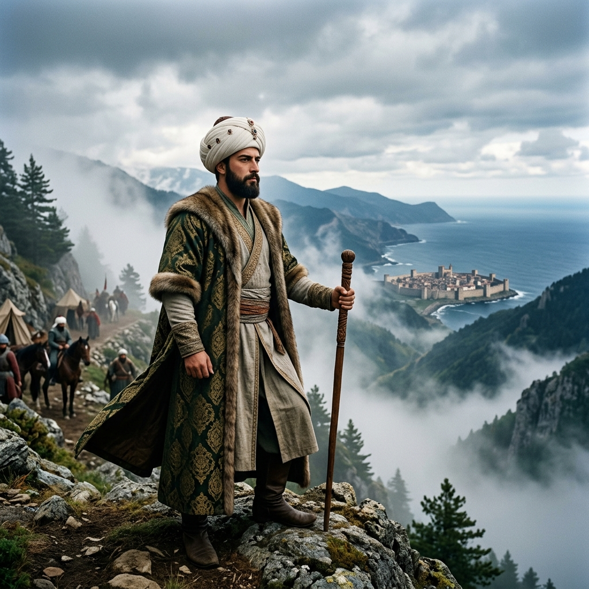

# Fatih Sultan Mehmet: Cihan Hâkimi ve Stratejist

1461 yılındaki Trabzon seferi, II. Mehmed'in sadece bir fatih değil, aynı zamanda fiziksel zorluklara göğüs geren bir "Gazi" ve rakipsiz bir stratejist olduğunun kanıtıdır.

## 1. Entelektüel Derinlik ve Vizyon
Fatih, Trabzon'u almayı İstanbul'un fethinin ayrılmaz bir parçası olarak görmüştür. Kendisini **Kayser-i Rum** olarak tanımlayan padişah için, Roma mirasının Anadolu'daki son kırıntısı olan Komnenos hanedanı, hukuki bir meşruiyet rakibiydi. Bu yüzden Trabzon, onun için sadece bir toprak parçası değil, ideolojik bir zorunluluktu.

## 2. Gazâ ve Meşakkat
Sefer sırasında Zigana dağlarında ordusuyla birlikte yaya yürümesi, elinde asasıyla askerine örnek olması, onun liderlik anlayışının zirvesidir. Sara Hatun ile olan meşhur diyaloğu, onun dünyevi bir toprak hırsından ziyade, "İ'lâ-yi Kelimetullah" davasına olan bağlılığını simgeler.

## 3. Diplomatik ve Askeri Deha
Akkoyunlu Uzun Hasan'ı tarafsızlaştırarak Trabzon'u yalnız bırakması, ardından deniz ve kara koordinasyonunu mükemmel bir şekilde yürütmesi, 15. yüzyıl askeri tarihinin en büyük başarılarından biridir.

> "İmkanın sınırını görmek için, imkansızı denemek lazım."
